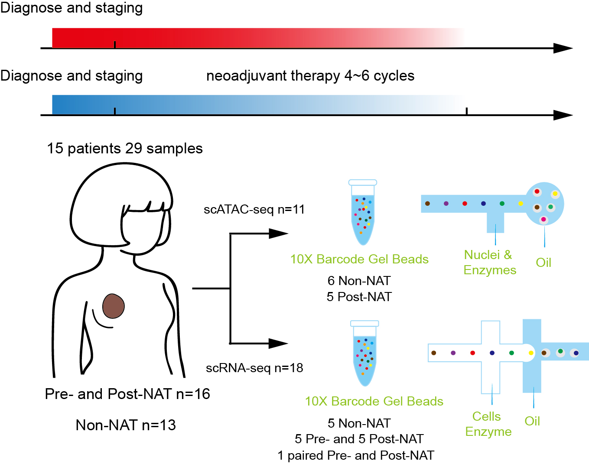

# Single-Cell RNA and ATAC Sequencing Reveal Cellular Heterogeneity and Chromatin Accessibility Dynamics in Young Chinese Breast Cancer Patients across Pre- and Post-Neoadjuvant Therapy 

**✨NEWS:** Our paper is now available on bioRxiv.[[preprint link\]](https://www.biorxiv.org/content/10.1101/2025.10.14.682233v1)

> This repository contains the complete single-cell RNA and ATAC sequencing analysis pipeline for the study "Single-Cell RNA and ATAC Sequencing Reveal Cellular Heterogeneity and Chromatin Accessibility Dynamics in Young Chinese Breast Cancer Patients across Pre- and Post-Neoadjuvant Therapy". It includes data processing, downstream analysis, and visualization scripts to reproduce the study's results.

## Overview

Young breast cancer (YBC) patients ( ≤ 40 years) exhibit aggressive features and poor prognosis, while facing complex needs including breast-conserving surgery and fertility preservation. Neoadjuvant therapy (NAT) is important for tumor downstaging and breast-conserving surgery in YBC treatment, but the NAT response mechanisms in YBC patients remain unelucidated. Here, we analyzed pre- and post-NAT samples from Chinese YBC patients using scRNA-seq and scATAC-seq. We found that reshaped the tumor microenvironment (TME), reducing epithelial cells and T cells while increasing endothelial cells and fibroblasts. Residual cancer cells showed enriched epithelial-mesenchymal transition (EMT) and stromal remodeling programs. Good NAT responders had fewer luminal-like cells and retained basal-like cells in an early hybrid EMT state, whereas poor responders maintained both populations with late hybrid EMT. We identified therapy-resistant genes and motifs (e.g., VTCN1, PROM1, MZB1, Fox family) and linked CXCL13 upregulation to poor NAT response and tumor-specific T-cell expansion. Cell–cell communication analysis revealed NAT reprograms the TME by suppressing VEGF and TNF signaling in basal cells, while residual luminal cells transmit EGFR and CD47–SIRPA signals.



**Highlights**

- NAT altered TME cellular composition with decreased epithelial and increased endothelial cells.

- Patients with good NAT response exhibited reduced luminal-like cells and retained basal-like cells.

- Elevated CXCL13 is associated with poor NAT response and tumor-specific T-cell expansion.

- NAT reshaped the TME of YBC by downregulating VEGF and TNF pathways in basal cells. 

## Instructions

#### 1. System Requirements

The codes have been implemented on Ubuntu 22.04 LTS. The installation on other operating systems (Windows) should be cautious due to Python packages.

#### 2. Packages and Installation

The codes require Python 3.10 or later and R 4.4.1 or later. The required Python packages are listed in the file requirements.txt, and the required R packages are managed using `renv`.

✨ To install the Python environment, you can run the command in the terminal:

```shell
git clone https://github.com/lyotvincent/BCY-NAT-analysis
cd BCY-NAT-analysis
pip install -r requirements.txt
Rscript install_renv.r
```

#### 3. Repository Structure

```
.
├── .gitignore               # Ignored files (e.g., virtual environment, large data)
├── README.md                # Project documentation (this file)
├── requirements.txt         # Dependencies for Python environment
├── figures/                 # Paper figures and Supplementary Figures    
├── scATAC/
│   ├── analysis/                # Downstream analysis scripts (no raw data processing)  
│   │   ├── 01_plot_majorType.ipynb  # # All scATAC data information
│   │   ├── 02_plot_epi.ipynb  # Epithelial cells analysis
│   │   ├── 03_plot_T.ipynb  # T cells analysis     
│   │   ├── 04_plot_myeloid.ipynb  # Myeloid cells analysis
│   ├── archr_proj/                 # Preprocessed data files (ready for analysis)
│   │   ├── ArchRProject  # All scATAC data     
│   │   ├── ArchRProject_epithelial  # Epithelial cells       
│   │   ├── ArchRProject_T  # T cells   
│   │   ├── ArchRProject_Myeloid  # Myeloid cells
|   ├── data_process/              # Raw data preprocessing scripts 
|   |   ├── 01_create_project.ipynb  # Create ArchRPorject
|   |   ├── 02_quality_check.ipynb  # QC
|   |   ├── 03_create_matrix.ipynb  # Add peakMatrix, GeneScoreMatrix, TileMatrix, homerMatrix
|   |   ├── 04_majorType.ipynb  # All scATAC data preprocessing
|   |   ├── 05_epi.ipynb  # Epithelial cells data preprocessing
|   |   ├── 06_T.ipynb  # T cells data preprocessing
|   |   ├── 07_Myeloid.ipynb  # Myeloid cells data preprocessing
|   ├── figures/                 # Output directory for generated figures (empty initially)
├── scRNA/  
│   ├── analysis/                # Downstream analysis scripts (no raw data processing)
│   │   ├── 01_patient_information.ipynb  # Plotting patient-related information
│   |   ├── 02_all_cells.ipynb  # All scRNA data information
│   |   ├── 03_epi.ipynb    # Epithelial cells analysis
│   |   ├── 04_T.ipynb      # T cells analysis
│   |   ├── 05_Myeloid.ipynb # Myeloid cells analysis
│   |   ├── 06_Fibro.ipynb    # Fibroblast cells analysis
│   |   ├── 07_endo.ipynb     # Endothelial cells analysis
│   |   ├── 08_B.ipynb    # B cells analysis
│   |   ├── 09_PVL.ipynb    # PVL cells analysis
│   |   ├── cellphonedb.ipynb    # Cell communication analysis
        ├── miloR.ipynb    # miloR abundance analysis
│   |   └── tcr.ipynb    # TCR analysis
|   ├── data_process/              # Raw data preprocessing scripts
|   |   ├── 01_epi.ipynb  # Epithelial cells data preprocessing
|   |   ├── 02_GeneNMF.ipynb  # GeneNMF analysis
|   |   ├── 03_epi_tumor.ipynb  # Tumor cells data preprocessing
|   |   ├── 04_T.ipynb  # T cells data preprocessing
|   |   ├── 05_Myeloid.ipynb  # Myeloid cells data preprocessing
|   |   ├── 06_Fibro.ipynb  # Fibroblast cells data preprocessing
|   |   ├── 07_endo.ipynb  # Endothelial cells data preprocessing
|   |   ├── 08_B.ipynb  # B cells data preprocessing
|   |   ├── 09_PVL.ipynb  # PVL cells data preprocessing
|   |   ├── cellphonedb.ipynb  # Data Preparation for cell communication analysis
|   |   └── milo_data_prepare.ipynb   # Data for MiloR analysis
|   ├── figures/                 # Output directory for generated figures (empty initially)
|   ├── h5ad/                    # Preprocessed data files (ready for analysis)
|   │   ├── adata-*.h5ad        # AnnData objects (single-cell expression + metadata)
|   |   ├── cellphonedb.zip     # Provides a complete resource collection required for intercellular communication analysis
|   │   └── gene_pos.txt        # Gene position annotation file
|   └── utils/
|   |   └── utils.py  # Tool function           
```

###### Key Directory Descriptions

**scRNA/h5ad/**

- Contains all **preprocessed scRNA-seq data** in `h5ad` format (AnnData objects), which include filtered expression matrices, cell annotations, clustering results, and metadata. Due to the large file size of these preprocessed datasets, they are not included in their entirety in this repository. To obtain the complete preprocessed data for analysis or figure reproduction, please contact the corresponding authors directly.
- Ready for direct use in downstream analysis (no need for raw data processing).
- Key files:
  - `adata-all-cells.h5ad`: Integrated single-cell dataset of all cell types.
  - `adata-epi-cnv.h5ad`: Epithelial cells with CNV calls (malignant vs. benign classification).

**scATAC/archr_proj/**

- Contains all **preprocessed scATAC-seq data** in Arrow format (ArchR project objects), including quality-controlled fragment information, peak matrices, cell annotations, clustering results, and metadata. Due to the large size of these preprocessed datasets, they are not fully included in this repository. To obtain the complete preprocessed scATAC-seq data for downstream analyses or figure reproduction, please contact the corresponding authors directly
- Ready for direct use in downstream analysis (no need for raw data processing).

**scRNA/data_process/**

- Scripts for **raw scRNA-seq data preprocessing** (input: raw sequencing data; output: `h5ad/` directory files).
- Core functions include:
  - Quality control (filtering low-quality cells/doublets).
  - Batch effect correction and data normalization.
  - Dimensionality reduction (PCA, UMAP) and unsupervised clustering.
  - Cell type annotation (based on canonical markers and CNV analysis).
- Run these scripts first if you need to reprocess raw data (raw sequencing data available via GSA-Human: HRA012799).

**scATAC/data_process/**

- Scripts for **raw scATAC-seq data preprocessing** (input: raw sequencing fragments; output: archr_proj/ directory files).
- Core functions include:
  - Quality control and doublet removal (filtering low-quality cells and potential multiplets).
  - Generation of Arrow files and creation of the ArchR project.
  - Dimensionality reduction (LSI, UMAP) and unsupervised clustering
  - Peak calling, motif enrichment, and gene activity score computation.
- Run these scripts first if you need to reprocess raw scATAC-seq data (raw fragment files available via GSA-Human: HRA012799).

**scRNA/analysis/**

- Scripts for **downstream scRNA-seq analysis** (input: preprocessed data from `scRNA/h5ad`; no raw data manipulation).
- Core analyses include:
  - Differential gene expression (DEG) analysis between groups.
  - Pathway enrichment (GO/KEGG/Hallmark) and meta program identification.
  - TCR clonal expansion and immune cell interaction analysis.
  - Visualization of key results (UMAP, heatmaps, violin plots).
- **Quick figure reproduction**: To rapidly recreate the figures published in the study, directly run the Jupyter Notebooks in the `scRNA/analysis/` directory. All figure-related code is embedded in these notebooks, with outputs saved to the `scRNA/figures/` directory.

**scATAC/analysis/**

- Scripts for **downstream scATAC-seq analysis** (input: preprocessed data from scATAC/archr_proj; no raw data manipulation).
- Core analyses include:
  - Differential peak and motif enrichment analysis between groups.
  - ChromVAR deviations and transcription factor activity enrichment analysis.
  - Footprinting analysis to assess transcription factor binding dynamics.
  - Integrated analysis with matched scRNA-seq data for regulatory network inference and multimodal visualization..
- **Quick figure reproduction**: To rapidly recreate the figures published in the study, directly run the Jupyter Notebooks in the `scATAC/analysis/` directory. All figure-related code is embedded in these notebooks, with outputs saved to the `scATAC/figures/` directory.

**scRNA/figures/**

- Empty directory to store output figures (generated by `scRNA/analysis/` scripts).
- All figures from the study (e.g., UMAP visualizations, heatmaps, pathway plots) can be reproduced here.
  
**scATAC/figures/**

- Empty directory to store output figures (generated by `scATAC/analysis/` scripts).
- All figures from the study (e.g., UMAP visualizations, heatmaps) can be reproduced here.

#### 4. Data availability 

- Raw sequencing data: GSA-Human (accession: HRA012799) → https://ngdc.cncb.ac.cn/gsa-human/
- Preprocessed data: Included in the `scRNA/h5ad/` directory of this repository (for quick analysis).
- Preprocessed data: Included in the `scATAC/archr_proj/` directory of this repository (for quick analysis).
  
  
For questions or issues related to the code/data, please contact:

- Jian Liu (jianliu@nankai.edu.cn)

For technical support, open an issue in the GitHub repository.